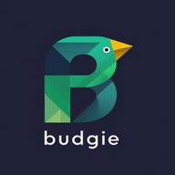

# 💰 Budgie - AI-Powered Personal Finance Management

<div align="center">




**Your Financial Bestie - A comprehensive, privacy-first Android finance app with on-device AI**

[Features](#-features) • [AI Engine](#-ai-engine) • [Screenshots](#-screenshots) • [Tech Stack](#-tech-stack) • [Getting Started](#-getting-started) • [Architecture](#-architecture) • [Security](#-security)

---

### 🎯 Overview

**Budgie** is a modern, feature-rich personal finance management application built with cutting-edge Android technologies. It combines intuitive expense tracking with powerful on-device AI/ML capabilities to provide personalized financial insights, spending predictions, and smart recommendations—all while keeping your data completely private on your device.

</div>

---

## ✨ Features

### 💸 Core Financial Management

| Feature | Description |
|---------|-------------|
| **Expense Tracking** | Record and categorize expenses with multi-item entry support and variable utility calculations |
| **Income Management** | Track multiple income sources (salary, freelance, investments, etc.) with recurring income support |
| **Budget Planning** | Create monthly/yearly budgets by category with progress tracking and overspend alerts |
| **Bill Management** | Never miss a payment with smart bill reminders and payment tracking |
| **Financial Goals** | Set short/medium/long-term goals with saving or loan funding options |
| **Loan Tracking** | Manage loans with interest calculations (flat rate, reducing balance, no interest) |
| **Shopping Lists** | AI-powered shopping list analysis with smart recommendations |

### 🤖 AI-Powered Insights

| Feature | Description |
|---------|-------------|
| **Behavior Learning** | On-device ML learns your spending patterns and habits |
| **Anomaly Detection** | Automatically flags unusual transactions |
| **Spending Predictions** | Forecasts future spending based on historical data |
| **Smart Recommendations** | Personalized financial advice based on your behavior |
| **Risk Assessment** | Evaluates your financial health and stability |
| **Goal Probability** | Calculates likelihood of achieving financial goals |
| **AI Chat Assistant** | Conversational AI for financial queries about your data |

### 📊 Analytics & Reporting

| Feature | Description |
|---------|-------------|
| **Expenditure Overview** | Daily, weekly, monthly, and annual spending views |
| **Spending Trends** | Visual charts showing spending patterns over time |
| **Category Breakdown** | Pie charts and analysis by expense category |
| **PDF/Excel Export** | Professional reports with colored tables and charts |
| **Wealth Projection** | Long-term financial forecasting |
| **Investment Tracking** | Monitor portfolio and calculate returns |

### 🔐 Security & Privacy

| Feature | Description |
|---------|-------------|
| **PIN Protection** | 5-digit PIN with weak PIN detection |
| **Biometric Auth** | Fingerprint and facial recognition support |
| **Encrypted Storage** | All sensitive data encrypted with AES-256 |
| **100% Offline** | No data ever leaves your device |
| **Session Management** | Auto-lock on app exit |

### 🎉 User Experience

| Feature | Description |
|---------|-------------|
| **Onboarding** | Beautiful glassmorphic onboarding with birthday capture |
| **Birthday Celebrations** | Personalized birthday page with balloons and music |
| **Smart Notifications** | Morning greetings, evening reminders, bill alerts |
| **Seasonal Messages** | Holiday-specific insights (Christmas, New Year, etc.) |
| **Dark Theme** | Premium navy + emerald color scheme |
| **Animated Splash** | Professional animated splash screen |

---

## 🧠 AI Engine

Budgie features a sophisticated **fully offline AI/ML pipeline** that runs entirely on-device:

### Architecture

```
┌─────────────────────────────────────────────────────────────────┐
│                    BUDGIE AI PIPELINE                           │
├─────────────────────────────────────────────────────────────────┤
│                                                                 │
│  ┌─────────────┐    ┌──────────────┐    ┌──────────────────┐   │
│  │   Feature   │───▶│   Behavior   │───▶│     Anomaly      │   │
│  │ Engineering │    │  Clustering  │    │    Detection     │   │
│  └─────────────┘    └──────────────┘    └──────────────────┘   │
│         │                  │                     │              │
│         ▼                  ▼                     ▼              │
│  ┌─────────────┐    ┌──────────────┐    ┌──────────────────┐   │
│  │ Time Series │───▶│   Pattern    │───▶│      Risk        │   │
│  │ Forecasting │    │ Recognition  │    │   Assessment     │   │
│  └─────────────┘    └──────────────┘    └──────────────────┘   │
│                             │                                   │
│                             ▼                                   │
│                    ┌──────────────────┐                        │
│                    │  Insight/NLG     │                        │
│                    │   Generation     │                        │
│                    └──────────────────┘                        │
└─────────────────────────────────────────────────────────────────┘
```

### ML Components

| Component | Model/Algorithm | Purpose |
|-----------|-----------------|---------|
| **Feature Extractor** | Rule-based | Transforms raw transactions into learnable signals |
| **Behavior Clusterer** | K-Means | Groups similar spending patterns (Saver, Spender, etc.) |
| **Anomaly Detector** | Z-Score + Rolling Stats | Detects unusual transactions |
| **Time Series Predictor** | ARIMA-like | Forecasts future spending |
| **Pattern Recognizer** | Heuristics + FFT | Identifies recurring expenses and pay cycles |
| **Risk Assessor** | Rule Engine | Evaluates financial health |
| **NLG Generator** | Template-based | Generates human-readable insights |

### Conversational AI

The AI Chat Assistant uses:
- **Intent Classification** - Understands what you're asking
- **Entity Extraction** - Extracts dates, amounts, categories
- **Context Memory** - Remembers conversation context
- **Financial Knowledge Base** - Trained on your spending data

---

## 📱 Screenshots

| Splash Screen | Onboarding | Dashboard |
|:-------------:|:----------:|:---------:|
| Animated logo with rotating rings | Glassmorphic design with birthday capture | Financial overview with AI insights |

| Goals | Loans | AI Chat |
|:-----:|:-----:|:-------:|
| Track saving goals with progress | Loan management with calculations | Chat with your financial AI |

| Insights | Export | Lock Screen |
|:--------:|:------:|:-----------:|
| AI-powered financial insights | Professional PDF/Excel reports | Biometric + PIN security |

---

## 🛠 Tech Stack

### Core Technologies

| Technology | Version | Purpose |
|------------|---------|---------|
| **Kotlin** | 2.0.21 | Primary programming language |
| **Jetpack Compose** | BOM 2024.09.00 | Modern declarative UI |
| **Material Design 3** | Latest | UI components and theming |
| **Room Database** | 2.6.1 | Local data persistence |
| **Kotlin Coroutines** | 1.7.3 | Asynchronous programming |
| **Navigation Compose** | 2.7.7 | Screen navigation |

### AI/ML Stack

| Technology | Version | Purpose |
|------------|---------|---------|
| **TensorFlow Lite** | 2.14.0 | On-device ML inference |
| **TensorFlow Lite Support** | 0.4.4 | ML utilities |
| **MediaPipe** | 0.10.11 | Generative AI tasks |
| **Apache Commons Math** | 3.6.1 | Statistical computations |

### Security

| Technology | Version | Purpose |
|------------|---------|---------|
| **Biometric API** | 1.1.0 | Fingerprint/Face authentication |
| **Security Crypto** | 1.1.0-alpha06 | AES-256 encrypted storage |

### Export & Reporting

| Technology | Version | Purpose |
|------------|---------|---------|
| **iText7** | 7.2.5 | Professional PDF generation |
| **Apache POI** | 5.2.3 | Excel file generation |

### Utilities

| Technology | Version | Purpose |
|------------|---------|---------|
| **Gson** | Latest | JSON serialization |
| **Kotlinx Serialization** | 1.6.0 | Kotlin-native serialization |
| **WorkManager** | 2.9.0 | Background task scheduling |
| **DataStore** | Latest | Preferences storage |

---

## 📁 Project Structure

```
app/src/main/java/com/example/budgie/
├── MainActivity.kt                 # Entry point
├── ai/                            # AI/ML Components
│   ├── AIModels.kt               # AI data models
│   ├── ConversationalAI.kt       # Chat assistant engine
│   ├── FinancialAIEngine.kt      # Main AI orchestrator
│   ├── FinancialAdvisor.kt       # Financial advice generator
│   ├── ShoppingListAnalyzer.kt   # Shopping AI analyzer
│   ├── conversational/           # Chat components
│   ├── ml/                       # ML Models
│   │   ├── BehaviorLearningEngine.kt   # Learning engine (1335 lines)
│   │   ├── BudgetOptimizer.kt          # Budget optimization
│   │   ├── OnDeviceAIEngine.kt         # On-device ML
│   │   └── TFLiteSpendingPredictor.kt  # TensorFlow predictions
│   └── pipeline/                 # AI pipeline components
├── data/                         # Data Layer
│   ├── local/                    # Room database
│   │   ├── BudgieDatabase.kt    # Database configuration
│   │   ├── ExpenseDao.kt        # Expense operations
│   │   ├── IncomeDao.kt         # Income operations
│   │   ├── BillDao.kt           # Bill operations
│   │   ├── BudgetDao.kt         # Budget operations
│   │   ├── GoalDao.kt           # Goal operations
│   │   ├── LoanDao.kt           # Loan operations
│   │   └── ShoppingDao.kt       # Shopping list operations
│   ├── model/                   # Data models
│   │   ├── Expense.kt           # Expense entity
│   │   ├── Income.kt            # Income entity
│   │   ├── Bill.kt              # Bill entity
│   │   ├── Budget.kt            # Budget entity
│   │   ├── GoalModels.kt        # Financial goals
│   │   ├── LoanModels.kt        # Loan entities
│   │   ├── ShoppingModels.kt    # Shopping list entities
│   │   ├── FinancialModels.kt   # Summary models
│   │   ├── UserProfile.kt       # User data
│   │   └── UtilityReading.kt    # Utility meter readings
│   ├── preferences/             # DataStore preferences
│   └── repository/              # Data repositories
├── notifications/               # Notification System
│   ├── NotificationHelper.kt   # Notification creation
│   └── NotificationWorkers.kt  # Background workers
├── security/                    # Security
│   └── SecurityManager.kt      # PIN/Biometric auth
├── ui/                         # UI Layer
│   ├── components/             # Reusable components
│   │   ├── AIDashboardCard.kt  # AI insights card
│   │   ├── CommonComponents.kt # Shared components
│   │   └── ExpenditureChart.kt # Chart components
│   ├── navigation/             # Navigation
│   │   └── BudgieNavigation.kt # Nav graph
│   ├── screens/                # App screens (17 screens)
│   │   ├── AIChatScreen.kt     # AI chat interface
│   │   ├── BillsScreen.kt      # Bill management
│   │   ├── BirthdayCelebrationScreen.kt
│   │   ├── BudgetScreen.kt     # Budget planning
│   │   ├── DashboardScreen.kt  # Main dashboard
│   │   ├── DashboardComponents.kt
│   │   ├── DashboardDialogs.kt
│   │   ├── ExpenseIncomeScreens.kt
│   │   ├── ExportScreen.kt     # Data export
│   │   ├── GoalsScreen.kt      # Financial goals
│   │   ├── InsightsInvestmentsScreen.kt
│   │   ├── LoansScreen.kt      # Loan management
│   │   ├── LockScreen.kt       # Security screen
│   │   ├── OnboardingScreen.kt # User onboarding
│   │   ├── ShoppingListScreen.kt
│   │   ├── SplashScreen.kt     # Animated splash
│   │   └── WealthProjectionScreen.kt
│   ├── theme/                  # Material theming
│   └── viewmodel/              # ViewModels
│       └── MainViewModel.kt    # App-wide ViewModel
└── util/                       # Utilities
    └── ExportManager.kt        # PDF/Excel export (1117 lines)
```

---

## 🚀 Getting Started

### Prerequisites

- **Android Studio** Hedgehog (2023.1.1) or newer
- **JDK 11** or higher
- **Android SDK** 34
- **Kotlin** 2.0.21
- Physical Android device or emulator (API 26+)

### Installation

1. **Clone the repository**
```bash
git clone https://github.com/yourusername/budgie.git
cd budgie
```

2. **Open in Android Studio**
```bash
# Or open Android Studio and select "Open Project"
open -a "Android Studio" .
```

3. **Sync Gradle**
   - Android Studio will automatically sync dependencies
   - If not, click `File → Sync Project with Gradle Files`

4. **Run on Device**
```bash
# Using Gradle
./gradlew installDebug

# Or use Android Studio's Run button
```

### Quick Build Commands

```bash
# Clean build
./gradlew clean assembleDebug

# Install on connected device
./gradlew installDebug

# Run tests
./gradlew test

# Generate release APK
./gradlew assembleRelease
```

---

## 🏗 Architecture

Budgie follows the **MVVM (Model-View-ViewModel)** architecture pattern with clean separation of concerns:

```
┌─────────────────────────────────────────────────────────────────┐
│                         UI LAYER                                │
│  ┌─────────────────────────────────────────────────────────┐   │
│  │               Jetpack Compose Screens                    │   │
│  │  (Dashboard, Expenses, Goals, Loans, AI Chat, etc.)     │   │
│  └────────────────────────┬────────────────────────────────┘   │
│                           │                                     │
│  ┌────────────────────────▼────────────────────────────────┐   │
│  │                    MainViewModel                         │   │
│  │          (StateFlow, Coroutines, LiveData)              │   │
│  └────────────────────────┬────────────────────────────────┘   │
├───────────────────────────┼─────────────────────────────────────┤
│                     DATA LAYER                                  │
│  ┌────────────────────────▼────────────────────────────────┐   │
│  │                   Repository                             │   │
│  │            (Single source of truth)                      │   │
│  └──────┬─────────────────┬─────────────────┬──────────────┘   │
│         │                 │                 │                   │
│  ┌──────▼──────┐   ┌──────▼──────┐   ┌──────▼──────┐          │
│  │    Room     │   │  DataStore  │   │   AI/ML    │          │
│  │  Database   │   │ Preferences │   │   Engine   │          │
│  └─────────────┘   └─────────────┘   └─────────────┘          │
└─────────────────────────────────────────────────────────────────┘
```

### Key Architectural Decisions

1. **Single Activity** - Navigation Compose handles all screen transitions
2. **StateFlow** - Reactive state management with Kotlin Flow
3. **Repository Pattern** - Abstracts data sources from UI
4. **Dependency Injection** - Manual DI for simplicity
5. **Offline-First** - All data stored locally with Room
6. **Privacy by Design** - No network requests, no tracking

---

## 🔒 Security

### Data Protection

- **Encrypted Preferences** - Using `EncryptedSharedPreferences` with AES-256-GCM
- **PIN Hashing** - SHA-256 hashed PINs, never stored in plain text
- **Biometric** - Hardware-backed biometric authentication
- **Session Lock** - App locks when backgrounded

### Privacy Principles

1. **No Internet Permission** - App works 100% offline
2. **No Analytics** - Zero tracking or telemetry
3. **No Cloud Sync** - Data never leaves your device
4. **User-Controlled Export** - Only you can export your data
5. **Encrypted Exports** - Optional PIN protection on PDF exports

---

## 📄 Data Export

Budgie supports professional data export in two formats:

### PDF Export
- 📊 Colored tables with professional styling
- 🎨 Branded header with user name and date
- 📑 Sections: Income, Expenses, Bills, Loans, Goals, Shopping Lists
- 🔐 Optional PIN protection
- 📁 Stored in Documents folder

### Excel Export
- 📈 Multi-sheet workbook
- 🔢 Formatted cells and headers
- 📊 Ready for further analysis
- 📁 `.xlsx` format compatible with Excel, Google Sheets

---

## 🔔 Notifications

Budgie features an intelligent notification system:

| Type | Schedule | Content |
|------|----------|---------|
| **Morning Greeting** | 8:00 AM | Personalized good morning + insight |
| **Evening Reminder** | 7:00 PM | Expense tracking reminder |
| **Bill Reminder** | 2 days before | Upcoming bill alerts |
| **Weekly Summary** | Sunday | Weekly spending summary |
| **Monthly Report** | 1st of month | Monthly financial review |
| **Birthday** | User's birthday | Celebration with balloons & music |
| **Seasonal** | Holidays | Christmas, New Year insights |

---

## 🤝 Contributing

While this is currently a private project, contributions may be welcome in the future:

1. Fork the repository
2. Create a feature branch (`git checkout -b feature/AmazingFeature`)
3. Commit changes (`git commit -m 'Add AmazingFeature'`)
4. Push to branch (`git push origin feature/AmazingFeature`)
5. Open a Pull Request

---

## 📝 License

This project is proprietary and confidential. All rights reserved.

---

## 🙏 Acknowledgments

- **Material Design 3** - Google's design system
- **Jetpack Compose** - Modern Android UI toolkit
- **TensorFlow Lite** - On-device machine learning
- **iText7** - PDF generation
- **Apache POI** - Excel generation

---

<div align="center">

**Built with ❤️ using Kotlin & Jetpack Compose**

**Budgie** - *Your Financial Bestie* 🐦💰

*100% Private • AI-Powered • Offline-First*

</div>

